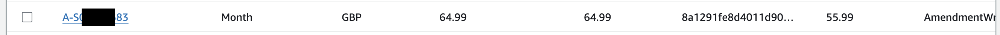

## The journey of a cohort item

In [Price migrations from first principles](./price-migrations-from-first-principles.md) we have seen what price migrations are, and the general logic behind then. In this chapter let's have a closer look at the actual steps of a price migration following the journey of a cohort item in the engine.

### What is a cohort item ?

In the engine parlance a "cohort" is a set of subscription numbers that are part of a given price migration. Logically a "cohort item" would then be one of those numbers, but in fact it refers to a record in the Dynamo table where the engine maintains information about the price migration.

One such cohort item seen in one of the Dynamo tables is shown below



The price migration may apply to a collection of subscriptions, but each subscription is price risen independently to the others (and yes, a price migration could just have one subscription in it), so to understand the logic of a migration we only need to follow the journey of one given subscription number.

### Loading the subscription numbers and creating the Dynamo table.

A price migration fundamentally need two ingredients:

1. The engine has been updated with the required code to encode the specificities of the migration (for instance specific features we implemented for Newspaper2024)

2. Marketing has provided us with the list of subscription numbers of all the subscriptions that are part of the migration. That list comes as a file with one subscription number per line, like this

```
S-00000001
S-00000002
S-00000003
S-00000004
etc..
``` 

At this point we need to have decided a name for the migration. Let's imagine we called it Newspaper2024. We locate the `price-migration-engine-prod` S3 bucket and create a directory called `Newspaper2024` in which we put a file called `subscription-numbers.csv`.

The engine will not automagically pick up the file, it needs to be instructed to do so (this will not be covered here), but the effect of the Dynamo table being created and the file having been loaded is that we now have a table with records and each record simply contains a subscription number.

To help with understanding of the following steps let's use a (simplified) version of the CohortItem case class in the engine Scala Code

```
case class CohortItem(
    subscriptionName : String,
    processingStage  : String,
    currency         : Option[String]     = None,
    billingPeriod    : Option[String]     = None,
    oldPrice         : Option[BigDecimal] = None,
    estimatedNewPrice: Option[BigDecimal] = None,
    startDate        : Option[LocalDate]  = None,
    newPrice         : Option[BigDecimal] = None,
)
```

So, when the subscription number is loaded into the table, the cohort item is essentially 

```
CohortItem(
    subscriptionName = "S-00000003"
)
```

With that said we need to indicate the processing stage an in that case it will be "ReadyForEstimation", so the cohort item is actually 

```
CohortItem(
    subscriptionName = "S-00000003"
    processingStage  = "ReadyForEstimation"
)
```

In this stage the engine essentially is saying "I have recorded this subscription number and it's ready to be Estimated"

### The Estimation Stage (part 1)

The first step of the Estimation stage is to run a maintenance function called `monitorDoNotProcessUntil` from the Estimation handler. This function requests items in processing stage `DoNotProcessUntil` and looks up the attribute `doNotProcessUntil`, which is a LocalDate, and check whether that date in in the past (or today). If that date is in the past, then the item is going to be migrated to processing stage `ReadyForEstimation`, otherwise the item is left untouched.

The reason for the extistence of the `DoNotProcessUntil` processing stage is that it was the simplest way to handle the existence of cancellation saves and the business requirement to leave a subscription alone for a certain period of time (6 months) if, at notification state, the item carries a cancellation discount. If and when we observe such a thing, we put the item in processing stage `DoNotProcessUntil`, and then update the value of the attribute `doNotProcessUntil` to be the date until when the item needs to be left alone. On that future date (or shortly after) the item can be processed again and the way this happens is to move it to `ReadyForEstimation` waiting for it to be estimated (again).

### The Estimation Stage (part 2)

The estimation stage has several purposes, in fact 3 main purposes 

1. Looking up metadata about the subscription in Zuora
2. Deciding what the post migration price is going to be
3. Deciding the start date, meaning the future billing date that the price rise is going apply.

Considering our subscription number `S-00000003`, let's imagine that the subscription look up in Zuora reveal the following information: currency: `EUR`, billing period: `Monthly`, old price: `52`. The cohort item then becomes

```
CohortItem(
    subscriptionName = "S-00000003"
    processingStage  = (...)
    currency         = Some("EUR")
    billingPeriod    = Some("Monthly")
    oldPrice         = Some(BigDecimal(52))
)
```

Let's also assume that we know that the most migration price for this subscription (considering the type of product it carries) is `61`. In the case of the Newspaper2024 migration, we knew the post migration price of any of the products because it was actually hardcoded in the engine code (or computed using the `ChargeDistribution2024` algebra we introduced). The cohort items becomes 

```
CohortItem(
    subscriptionName  = "S-00000003"
    processingStage   = (...)
    currency          = Some("EUR")
    billingPeriod     = Some("Monthly")
    oldPrice          = Some(BigDecimal(52))
    estimatedNewPrice = Some(BigDecimal(61))
)
```

where "estimatedNewPrice" refers to the price post-rise. 

The last bit of data is the billing date that the price rise should be applied to. If you remember the explanations in Chapter 1, we saw that this date is computed considering a collection of factors (how old the subscription is, the billing period, how close the next natural billing period would be to the earliest possible time for notification and the need to wait at least 30 days etc). Let's imagine that the computed start date is `2024-05-10`. The cohort item becomes

```
CohortItem(
    subscriptionName  = "S-00000003"
    processingStage   = (...)
    currency          = Some("EUR")
    billingPeriod     = Some("Monthly")
    oldPrice          = Some(BigDecimal(52))
    estimatedNewPrice = Some(BigDecimal(61))
    startDate         = Some(LocalDate.of(2024, 5, 10))
)
```

At this stage the cohort items has been "estimated". Technically the cohort item is now in processing stage `EstimationComplete`. With that said, the engine is immediately going to create a record in Salesforce to mark the subscription in Salesforce with the new post migration price. At this point the processing stage is now `SalesforcePriceRiceCreationComplete`.

```
CohortItem(
    subscriptionName  = "S-00000003"
    processingStage   = "SalesforcePriceRiceCreationComplete"
    currency          = Some("EUR")
    billingPeriod     = Some("Monthly")
    oldPrice          = Some(BigDecimal(52))
    estimatedNewPrice = Some(BigDecimal(61))
    startDate         = Some(LocalDate.of(2024, 5, 10))
)
```

Then, the cohort item is going to.... sleep. It's going to sleep as long as it take for it to be at the start date minus about 40 days. This might take a few days or up to a year.

### Notification (part 1)

In the case of migration SupporterPlus2024, the first operation is to check whether the item is under an active cancellation save. By definition, an "active" cancellation save is a cancellation save that was issued less than 6 months ago. If the item is found in that state, its processing stage become `DoNotProcessUntil` and the value of `doNotProcessUntil` is updated to become the effective date of the cancelation save plus 6 months.

### Notification (part 2)

Today is now `LocalDate.of(2024, 5, 10)` minus about 40 days. The engine sees a subscription in `SalesforcePriceRiceCreationComplete` stage ready to be user notified. The engine is going to perform a certain number of lookups and will send a message to a queue that will eventually be delivered to Braze (triggering the sending of an email, or sending an additional request to an external company for a letter to be printed and delivered).

The message to the user is going to mention the start date and the new estimated new price. The outcome of this step is the subscription being put in processing stage `NotificationSendComplete`.

Once the item is in `NotificationSendComplete` stage the SalesforceNotificationDateUpdatehandler lambda will fire up. This operation notifies Salesforce that the user has been notified (for record keeping) and puts the item in processing stage `NotificationSendDateWrittenToSalesforce`.

### Amendment

The item now being in processing stage `NotificationSendDateWrittenToSalesforce` the engine will perform an amendment in Zuora, meaning will update Zuora with the fact that the subscription in Zuora is price risen and that the price rise is taking effect on the date that had already been decided during the Estimation step. Note that this is the first and only moment that the engine performs a write operation in Zuora during the entire price rise process of that subscription and puts the item in `AmendmentComplete`.

The next step is yet another Salesforce update, where we inform Salesforce that the subscription in Zuora has been edited for price rise. Then the processing stage becomes `AmendmentWrittenToSalesforce`. This completes the price rise of subscription "S-00000003".

It is also important to notice that the amendment step only happened after the user notification step. This is a security to avoid a situation where there would be a bug in the engine or even just a long outage, causing subscriptions to be price risen in Zuora without the users having (yet) been notified. That would be illegal and put the Guardian in hot water.

Last, but not least, this entire section, eg: moving through 

- `SalesforcePriceRiceCreationComplete`
- `NotificationSendComplete`
- `NotificationSendDateWrittenToSalesforce`
- `AmendmentComplete`
- `AmendmentWrittenToSalesforce`

happens the same day. Being independent steps it is possible to delay the next one of the sequence, but there is also value in letting in them complete the same day, so that is a customer calls a CRS, they see, in Zuora and Salesforce, an up-to-date view of what the engine was in the process of doing.

### Zuora Cancellations

As we have seen a cohort item / subscription can sleep for a long time before it is ready to move to notification process, but what happens if the subscription has been cancelled by the user in the meantime ?

In such a case, the engine will detect that the subscription has been cancelled in Zuora and will move the cohort item to `ZuoraCancellation` processing stage

```
CohortItem(
    subscriptionName  = "S-00000003"
    processingStage   = "ZuoraCancellation"
)
```

Once the cohort item is in `ZuoraCancellation` state the engine will no longer touch it. Alike `AmendmentWrittenToSalesforce`, `ZuoraCancellation` is a final state for a cohort item.

### Cancelled processing stage

A Zuora cancellation (indicated by `ZuoraCancellation`), as well as when the cohort item doesn't need to be price risen (indicated by `NoPriceIncrease`), are the two non error ways that the engine can put a cohort item in. Another terminaal state, and in fact that most general terminal state is `Cancelled`

```
CohortItem(
    subscriptionName  = "S-00000003"
    processingStage   = "Cancelled"
)
```

At the time these lines are written (August 2025), it is generated only by RateplansProbe inside the notification handler. It is now much less common in the engine due to the introduction of the non standard processing stages (next section).

### Non standard processing stages

The `Cancelled` processing stage in not the only processing stage a subscription can be put in when something goes wrong and the migration cannot pursue on it. Three other processing stages can be found in Dynamo table when Pascal investigates a failure from an handler. In such cases the item can be put manually in 
- `EstimationFailed` (failure mode for `EstimationComplete`)
- `NotificationSendFailed` (failure mode for `NotificationSendComplete`)
- `AmendmentFailed` (failure mode for `AmendmentComplete`)

The advantage of specifing the stage that was current when the failure happened helps recovering from the failure (when an attemps to do so is performed)

### Processing Lambdas

The price migration engine define a state machine which is linear. The lambdas fire in a given linear order (ocassionaly the same lambda fires more than once) For reference here is the other in which the lambda fire 

- CohortTableCreationHandler
- SubscriptionIdUploadHandler
- EstimationHandler
- SalesforcePriceRiseCreationHandler
- NotificationHandler
- SalesforceNotificationDateUpdateHandler
- AmendmentHandler
- SalesforceAmendmentUpdateHandler
- CohortTableDatalakeExportHandler
