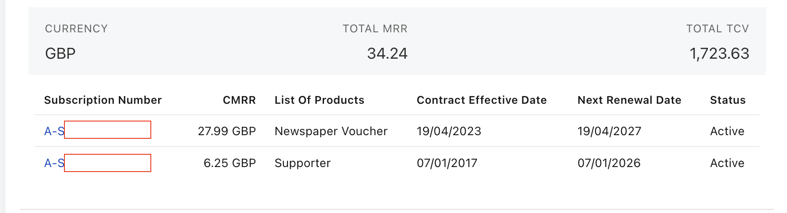

This subscription has the property that at the time it was captured (17 October 2025), the first element of the invoice preview 

```
{
  "id": "30fc288922524e1eb142a424b8d3eae2",
  "subscriptionName": "VOUCHER-SUBSCRIPTION-NUMBER",
  "subscriptionId": "VOUCHER-SUBSCRIPTION-ID",
  "subscriptionNumber": "VOUCHER-SUBSCRIPTION-NUMBER",
  "serviceStartDate": "2025-10-20",
  "serviceEndDate": "2025-11-19",
  "chargeAmount": 13.98,
  "chargeDescription": "",
  "chargeName": "Sunday",
  "chargeNumber": "C-07112368",
  "chargeId": "8a12823f98a804270198b0b6c71c5be3",
  "productName": "Newspaper Voucher",
  "quantity": 1,
  "taxAmount": 0.0,
  "unitOfMeasure": "",
  "chargeDate": "2025-10-17 09:26:17",
  "chargeType": "Recurring",
  "processingType": "Charge",
  "appliedToItemId": null,
  "numberOfDeliveries": 0.0
}
```

didn't have a charge corresponding of the subscription current active rate plan. This was a problem because the introspection code was working on the principle that it could just take the charge number of the first invoice preview item, and look for it in the subscription.

The problem was that the invoice preview lists the billing events of all the products of an account, and in this case there was more than one product on the account



A latter invoice preview items was the one we were looking for, and the charge number, the one we needed

```
{
  "id": "448aeb0bac5342b3aaacee7b0eb16e2f",
  "subscriptionName": "MEMBERSHIP-SUBSCRIPTION-NUMBER",
  "subscriptionId": "8a129db299ed0b290199f146dbad241a",
  "subscriptionNumber": "MEMBERSHIP-SUBSCRIPTION-NUMBER",
  "serviceStartDate": "2026-01-07",
  "serviceEndDate": "2027-01-06",
  "chargeAmount": 75.0,
  "chargeDescription": "",
  "chargeName": "Supporter Membership - Annual",
  "chargeNumber": "C-04845466",
  "chargeId": "8a129f7a8c101a00018c38c9c5111043",
  "productName": "Supporter",
  "quantity": 1,
  "taxAmount": 0.0,
  "unitOfMeasure": "",
  "chargeDate": "2025-10-17 09:26:17",
  "chargeType": "Recurring",
  "processingType": "Charge",
  "appliedToItemId": null,
  "numberOfDeliveries": 0.0
}
```
